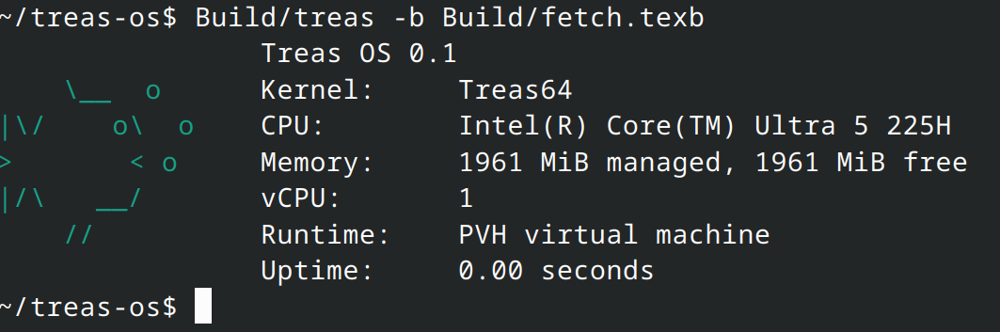

<div align="center">

# Treas OS

**A compact NT-inspired x86_64 operating system for isolated native applications.**




</div>

Treas starts a fresh virtual machine for one `.texb` application, streams its output directly to the host terminal, returns its exit code, and shuts down. KVM is selected automatically when available; otherwise QEMU TCG is used.

## Quick start

Requires GCC, NASM, GNU ld, Python 3, and `qemu-system-x86_64`.

```sh
make all
export PATH="$PWD/Build:$PATH"

treas -b Build/fetch.texb
treas -b Build/testapp.texb -- argument
```

Only application output is written to stdout and stderr. Host files can be explicitly preopened for the guest:

```sh
treas -b Build/app.texb --read Input.bin --write Output.bin
```

## Included

| Kernel | Runtime |
|---|---|
| Ring 3 processes and threads | Freestanding C SDK |
| 4 KiB virtual memory with NX and W^X | 64 KiB arena heap |
| NT-style processes, handles, and events | stdin, stdout, and stderr |
| TSC timekeeping and on-demand PIT | Preopened host files |
| Shared-memory `ivshmem` transport | 11 native system calls |

## Development

```sh
make test       # integration and protection tests
make benchmark  # VM startup latency
make clean
```

The code uses PascalCase paths, NT-style subsystem prefixes, small subsystem-specific files, and a versioned public ABI in [`Include/Treas/UserApi.h`](Include/Treas/UserApi.h).

Released under the [MIT License](LICENSE).
